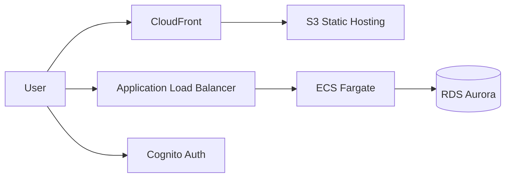
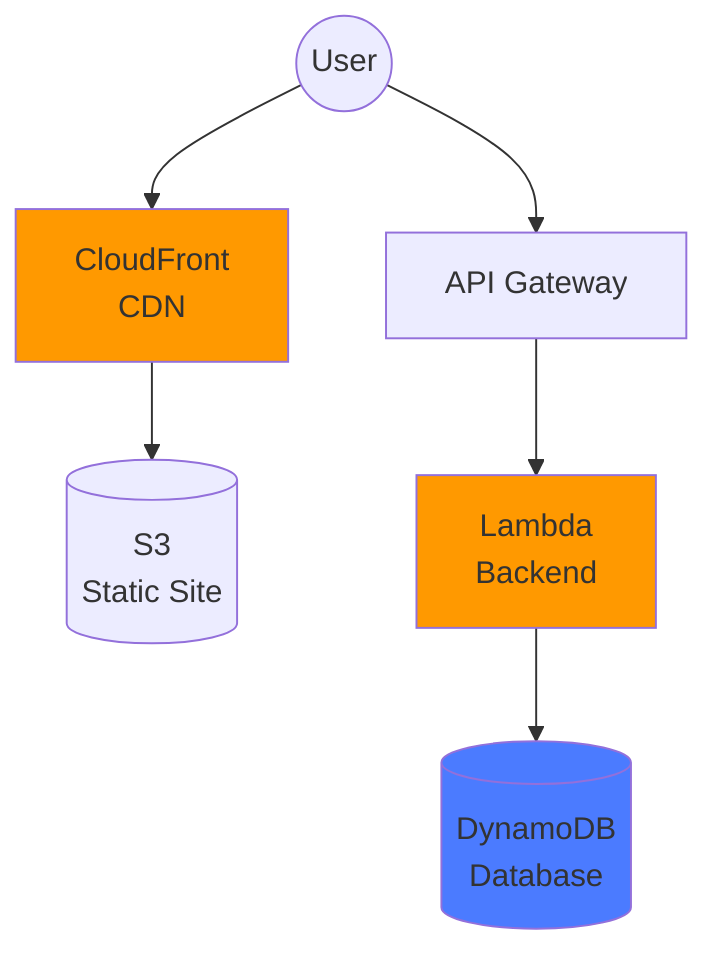

# AWS Architecture Copilot - Technical Plan

**Project**: AI Agent for AWS Architecture Generation  
**Tech Stack**: TypeScript + Strands + AWS Bedrock + MCP  
**Created**: February 1, 2026  
**Status**: Week 1 - Setup & Foundation

---

## 1. Project Overview

### Problem Statement

Organizations struggle to translate high-level business requirements into production-ready AWS architectures. This process typically requires:

- **Deep AWS expertise** across 200+ services with constantly evolving best practices
- **Manual documentation search** through thousands of AWS documentation pages
- **Time-consuming design iterations** bouncing between architects, security teams, and developers
- **Inconsistent quality** depending on architect experience and current knowledge
- **Repetitive work** for common patterns (web apps, data pipelines, microservices)

**Current pain points**:
- Junior engineers spend hours searching AWS docs for service recommendations
- Architects repeat the same architecture patterns with slight variations
- Documentation becomes outdated as new AWS services launch
- Infrastructure-as-code generation is manual and error-prone
- No single source of truth combining AWS best practices with IaC output

### Solution Description

AWS Architecture Copilot is an **AI agent** that generates production-ready AWS architectures from natural language requirements. It combines:

1. **Claude Sonnet 4 reasoning** via AWS Bedrock for intelligent service selection
2. **Real-time AWS documentation** via MCP server (no stale training data)
3. **Automated diagram generation** using Mermaid.js flowcharts
4. **Deployable infrastructure code** via TypeScript AWS CDK output

**User workflow**:
```
User → Natural language requirement
  ↓
Agent → Analyzes requirements + queries AWS docs via MCP
  ↓
Agent → Selects appropriate AWS services
  ↓
Agent → Generates Mermaid diagram + TypeScript CDK code
  ↓
User → Reviews architecture + deploys with `cdk deploy`
```

**Example input**:
> "Design a scalable web application with user authentication, file uploads, and MySQL database. Budget is $500/month. Must support 10,000 daily active users."

**Example output**:
- Mermaid architecture diagram showing CloudFront → ALB → ECS Fargate → RDS Aurora
- Complete TypeScript CDK stack with networking, security groups, auto-scaling
- Cost estimate and deployment instructions

### Target Users

**Primary**: Mid-level cloud engineers (2-5 years experience)
- Understand basic AWS concepts but lack deep architectural expertise
- Need to design systems faster without constant documentation lookups
- Want to follow AWS best practices without memorizing 6 pillars

**Secondary**: Senior architects
- Use tool to accelerate initial design phase
- Generate first-draft architectures for review/iteration
- Ensure junior team members follow established patterns

**Tertiary**: Engineering managers / CTOs
- Evaluate architecture approaches without deep AWS knowledge
- Understand cost implications before committing to design
- Standardize architecture across teams

---

## 2. Technical Architecture

### System Architecture Diagram

```
┌─────────────────────────────────────────────────────────────────┐
│                         USER INPUT                              │
│  Natural language requirement + constraints (cost, region, etc) │
└──────────────────────┬──────────────────────────────────────────┘
                       │
                       ▼
┌─────────────────────────────────────────────────────────────────┐
│                    STRANDS AGENT                                │
│  ┌──────────────────────────────────────────────────────────┐  │
│  │  Agent State (ArchitectureState)                         │  │
│  │  - userRequirements: string                              │  │
│  │  - selectedServices: Service[]                           │  │
│  │  - architectureType: "web" | "data" | "microservices"   │  │
│  │  - constraints: { budget, region, scale }                │  │
│  └──────────────────────────────────────────────────────────┘  │
│                                                                  │
│  ┌──────────────────────────────────────────────────────────┐  │
│  │  Model: AWS Bedrock (Claude Sonnet 4)                    │  │
│  │  - Temperature: 0.3 (deterministic service selection)    │  │
│  │  - Max tokens: 8000 (for complex architectures)          │  │
│  └──────────────────────────────────────────────────────────┘  │
└──────────┬───────────────────────────┬───────────────────┬──────┘
           │                           │                   │
           ▼                           ▼                   ▼
┌──────────────────┐     ┌─────────────────────┐   ┌────────────────┐
│   MCP CLIENT     │     │  TOOL: CDK Generator │   │ TOOL: Diagram  │
│                  │     │                      │   │   Generator    │
│ AWS Docs Server  │     │ Generates TypeScript │   │                │
│ (via uvx)        │     │ CDK stacks from      │   │ Generates      │
│                  │     │ selected services    │   │ Mermaid.js     │
│ Tools:           │     │                      │   │ flowcharts     │
│ - search_docs    │     │ Input: Service list  │   │                │
│ - read_docs      │     │ Output: CDK code     │   │ Input: Services│
│                  │     │                      │   │ Output: Diagram│
└──────────────────┘     └─────────────────────┘   └────────────────┘
           │                           │                   │
           └───────────────┬───────────┴───────────────────┘
                           ▼
                 ┌─────────────────────┐
                 │   AGENT RESPONSE    │
                 │                     │
                 │ 1. Explanation      │
                 │ 2. Mermaid diagram  │
                 │ 3. CDK TypeScript   │
                 │ 4. Cost estimate    │
                 │ 5. Next steps       │
                 └─────────────────────┘
```

### Component Responsibilities

**Strands Agent**:
- Orchestrates workflow through 5-step process
- Maintains conversation state across multiple queries
- Decides when to call MCP vs when to use tools
- Combines AWS best practices with user constraints

**AWS Bedrock (Claude Sonnet 4)**:
- Parses natural language requirements
- Classifies architecture type (web, data pipeline, microservices, etc.)
- Selects appropriate AWS services based on constraints
- Generates human-readable explanations

**MCP Client (AWS Documentation Server)**:
- Searches AWS documentation for service-specific guidance
- Retrieves Well-Architected Framework recommendations
- Provides real-time best practices (not stale training data)
- Returns structured documentation excerpts

**CDK Generator Tool**:
- Converts service selections into TypeScript CDK code
- Applies infrastructure best practices (security groups, IAM roles, tagging)
- Generates complete, deployable stacks
- Includes helpful comments for customization

**Mermaid Diagram Tool**:
- Visualizes architecture as flowchart
- Shows data flow between services
- Highlights critical paths (user → frontend → backend → database)
- Outputs text that renders in GitHub, VS Code, etc.

### Data Flow

1. **User input** → Agent state (`userRequirements`)
2. **Agent analyzes** → Classifies architecture type, extracts constraints
3. **MCP query** → "Best practices for [architecture type]"
4. **Agent reasons** → Selects AWS services matching requirements
5. **Tool invocation** → Generate CDK code + Mermaid diagram
6. **Agent response** → Structured output with explanation

---

## 3. Agent Workflow

The agent follows a **5-step deterministic workflow** for each architecture request:

### Step 1: Understand Requirements

**Goal**: Parse user input and extract structured constraints

**Actions**:
- Parse natural language requirement
- Classify architecture type: `web_application` | `data_pipeline` | `microservices` | `batch_processing` | `real_time_streaming`
- Extract constraints:
  - Budget: monthly cost limit
  - Scale: expected traffic/load
  - Region: AWS region preference
  - Compliance: HIPAA, PCI-DSS, SOC 2, etc.
  - Performance: latency, throughput requirements

**Example**:
```typescript
Input: "Build a HIPAA-compliant medical records system with 50ms response time"
Output State:
{
  architectureType: "web_application",
  constraints: {
    compliance: ["HIPAA"],
    performance: { maxLatency: "50ms" },
    scale: { users: "unknown" }
  }
}
```

### Step 2: Retrieve Best Practices

**Goal**: Query AWS documentation for relevant guidance

**Actions**:
- Call MCP `search_documentation` tool with architecture type
- Retrieve Well-Architected Framework pillars
- Get service-specific recommendations (e.g., "RDS vs DynamoDB for web apps")
- Extract compliance requirements (e.g., HIPAA-eligible services)

**Example MCP queries**:
- "AWS best practices for web application architecture"
- "HIPAA-compliant AWS services for healthcare data"
- "High-performance database options for <50ms latency"

**Output**: AWS documentation excerpts stored in agent state

### Step 3: Design Architecture

**Goal**: Select specific AWS services matching requirements

**Actions**:
- Reason about service tradeoffs using Claude Sonnet 4
- Apply constraint filters:
  - Budget → eliminate expensive options
  - Compliance → filter to HIPAA-eligible services
  - Scale → choose managed/serverless when possible
- Select services with justification

**Example service selection**:
```typescript
{
  frontend: {
    service: "CloudFront + S3",
    reason: "Static hosting for low latency, global CDN"
  },
  backend: {
    service: "ECS Fargate",
    reason: "Containerized, auto-scaling, HIPAA-eligible"
  },
  database: {
    service: "RDS Aurora (encrypted)",
    reason: "HIPAA-compliant, <50ms with read replicas"
  },
  authentication: {
    service: "Cognito",
    reason: "Managed identity, HIPAA BAA available"
  }
}
```

### Step 4: Generate Artifacts

**Goal**: Produce deployable outputs

**Actions**:
- Invoke `generate_mermaid_diagram` tool
  - Input: Selected services
  - Output: Mermaid.js flowchart text
- Invoke `generate_cdk_code` tool
  - Input: Services + constraints
  - Output: TypeScript CDK stack
- Calculate cost estimate (optional)

**Example Mermaid output**:


**Example CDK output**:
```typescript
import * as cdk from 'aws-cdk-lib';
import * as ec2 from 'aws-cdk-lib/aws-ec2';
import * as ecs from 'aws-cdk-lib/aws-ecs';
import * as rds from 'aws-cdk-lib/aws-rds';

export class MedicalRecordsStack extends cdk.Stack {
  constructor(scope: cdk.App, id: string) {
    super(scope, id);
    
    // VPC with private subnets (HIPAA requirement)
    const vpc = new ec2.Vpc(this, 'VPC', {
      maxAzs: 3,
      natGateways: 2
    });
    
    // ... (full stack definition)
  }
}
```

### Step 5: Return Results

**Goal**: Present architecture to user with clear next steps

**Actions**:
- Format response with sections:
  1. **Architecture Overview**: High-level explanation
  2. **Selected Services**: List with justifications
  3. **Mermaid Diagram**: Visual representation
  4. **CDK Code**: Deployable TypeScript
  5. **Cost Estimate**: Monthly AWS bill projection
  6. **Next Steps**: Deployment instructions

**Example response structure**:
```markdown
## Architecture Overview
I've designed a HIPAA-compliant medical records system using...

## Selected AWS Services
- **Frontend**: CloudFront + S3 (reason...)
- **Backend**: ECS Fargate (reason...)
- **Database**: RDS Aurora encrypted (reason...)

## Architecture Diagram
[Mermaid code here]

## Infrastructure Code
[TypeScript CDK code here]

## Cost Estimate
Estimated monthly cost: $450-600 (depends on traffic)

## Next Steps
1. Review code and customize as needed
2. Run `cdk deploy` to provision infrastructure
3. Complete HIPAA BAA with AWS
```

---

## 4. Tech Stack Decisions

### Why Strands Over LangGraph?

**Strands Advantages**:
- **Native AWS Bedrock support**: No custom API wrappers needed
- **Built-in MCP integration**: Works with AWS Documentation MCP server out-of-the-box
- **Simpler agent definition**: Less boilerplate than LangGraph's node/edge graph
- **TypeScript-first**: Better type safety for CDK code generation
- **Smaller learning curve**: Fewer abstractions to learn

**LangGraph downsides for this project**:
- Python-centric (would require Python→TypeScript bridge for CDK output)
- Graph complexity overkill for linear 5-step workflow
- More verbose configuration for simple agent patterns

**Decision**: Strands is purpose-built for this exact use case (AWS + TypeScript + MCP)

### Why MCP Over Custom RAG?

**MCP Advantages**:
- **Zero vector database setup**: No need for Pinecone, Weaviate, or pgvector
- **Always up-to-date**: AWS maintains documentation; no stale embeddings
- **Pre-built AWS server**: `awslabs.aws-documentation-mcp-server` includes search + retrieval
- **Faster implementation**: 1 day vs 1-2 weeks for custom RAG
- **Lower operational cost**: No vector DB hosting fees

**Custom RAG downsides**:
- Requires embedding generation (OpenAI API costs)
- Vector database maintenance and scaling
- Re-indexing when AWS docs update
- Complex retrieval tuning (chunk size, similarity threshold)

**Decision**: MCP eliminates entire RAG infrastructure for 90% of the benefit

### Why TypeScript Over Python?

**TypeScript Advantages**:
- **AWS CDK native language**: Direct CDK code generation without translation
- **Type safety**: Prevents runtime errors in generated infrastructure code
- **Better IDE support**: IntelliSense for AWS constructs
- **Single language**: Agent + CDK output both TypeScript
- **Industry standard**: Most AWS teams already use TypeScript for IaC

**Python downsides**:
- Would generate CDK code in different language than agent
- Pulumi (Python IaC) less common than CDK in AWS ecosystem
- Weaker type safety for infrastructure code

**Decision**: TypeScript unifies the stack and matches AWS community standards

---

## 5. Agent State Design

### ArchitectureState Interface

```typescript
/**
 * Agent state representing the current architecture design session
 * Flows through all 5 workflow steps
 */
export interface ArchitectureState {
  /** Original user requirement in natural language */
  userRequirements: string;
  
  /** Parsed constraints extracted from requirements */
  constraints: {
    budget?: {
      monthly: number;  // USD per month
      currency: "USD" | "EUR";
    };
    scale?: {
      dailyActiveUsers?: number;
      requestsPerSecond?: number;
      storageGB?: number;
    };
    region?: string;  // AWS region (e.g., "us-east-1")
    compliance?: string[];  // e.g., ["HIPAA", "PCI-DSS"]
    performance?: {
      maxLatency?: string;  // e.g., "50ms"
      throughput?: string;  // e.g., "10000 rps"
    };
  };
  
  /** Architecture classification */
  architectureType: 
    | "web_application"
    | "data_pipeline"
    | "microservices"
    | "batch_processing"
    | "real_time_streaming"
    | "machine_learning";
  
  /** AWS best practices retrieved from MCP */
  bestPractices?: {
    source: string;  // Documentation URL
    content: string;  // Relevant excerpt
  }[];
  
  /** Selected AWS services with justifications */
  selectedServices?: {
    category: string;  // e.g., "compute", "database", "storage"
    service: string;  // e.g., "ECS Fargate"
    reason: string;  // Why this service was chosen
    config?: Record<string, any>;  // Service-specific config
  }[];
  
  /** Generated Mermaid diagram */
  diagram?: string;
  
  /** Generated TypeScript CDK code */
  cdkCode?: string;
  
  /** Estimated monthly cost in USD */
  costEstimate?: {
    min: number;
    max: number;
    breakdown: Record<string, number>;  // Per-service costs
  };
}
```

### State Flow Example

```typescript
// Step 1: Initial state after parsing requirements
{
  userRequirements: "Scalable e-commerce site, 10k users/day, $500/month budget",
  constraints: {
    budget: { monthly: 500, currency: "USD" },
    scale: { dailyActiveUsers: 10000 }
  },
  architectureType: "web_application"
}

// Step 2: After MCP retrieval
{
  // ... (previous state)
  bestPractices: [
    {
      source: "https://docs.aws.amazon.com/wellarchitected/...",
      content: "For web applications, use managed services..."
    }
  ]
}

// Step 3: After service selection
{
  // ... (previous state)
  selectedServices: [
    {
      category: "frontend",
      service: "CloudFront + S3",
      reason: "Static hosting, low cost, global CDN"
    },
    {
      category: "compute",
      service: "Lambda + API Gateway",
      reason: "Serverless, pay-per-request, scales automatically"
    }
  ]
}

// Step 4: After artifact generation
{
  // ... (previous state)
  diagram: "graph LR\n  User --> CloudFront...",
  cdkCode: "import * as cdk from 'aws-cdk-lib'...",
  costEstimate: {
    min: 350,
    max: 480,
    breakdown: {
      "CloudFront": 50,
      "Lambda": 100,
      "DynamoDB": 200
    }
  }
}
```

---

## 6. Tool Specifications

### Tool 1: generate_cdk_code

**Purpose**: Generate TypeScript AWS CDK infrastructure code from service selections

**Input Schema**:
```typescript
{
  services: {
    category: string;
    service: string;
    config?: Record<string, any>;
  }[];
  stackName: string;
  region?: string;
}
```

**Output**:
```typescript
{
  code: string;  // Complete TypeScript CDK stack
  dependencies: string[];  // npm packages needed
}
```

**Implementation approach**:
1. Map service names to CDK constructs (e.g., "Lambda" → `aws-cdk-lib/aws-lambda`)
2. Apply best practices:
   - VPC with private subnets for databases
   - Security groups with least privilege
   - IAM roles with minimal permissions
   - Encryption at rest and in transit
   - CloudWatch alarms for critical metrics
3. Generate human-readable comments
4. Format with Prettier

**Example usage**:
```typescript
const tool = tool({
  name: "generate_cdk_code",
  description: "Generates TypeScript AWS CDK infrastructure code",
  schema: z.object({
    services: z.array(z.object({
      category: z.string(),
      service: z.string(),
      config: z.record(z.any()).optional()
    })),
    stackName: z.string()
  }),
  callback: async (input) => {
    const cdkGenerator = new CDKGenerator();
    return cdkGenerator.generate(input);
  }
});
```

### Tool 2: generate_mermaid_diagram

**Purpose**: Generate Mermaid.js flowchart visualizing architecture

**Input Schema**:
```typescript
{
  services: {
    category: string;
    service: string;
  }[];
  architectureType: string;
}
```

**Output**:
```typescript
{
  diagram: string;  // Mermaid.js syntax
  renderUrl: string;  // URL to live preview
}
```

**Implementation approach**:
1. Create nodes for each service with icons/labels
2. Infer connections based on architecture type:
   - Web apps: User → Frontend → Backend → Database
   - Data pipelines: Source → Processing → Storage → Analytics
   - Microservices: API Gateway → Services → Databases
3. Apply styling (colors, shapes)
4. Generate valid Mermaid.js syntax

**Example output**:


---

## 7. Success Metrics

### Functional Requirements

**Must have** (Week 1-2):
- ✅ Agent successfully parses 5 different architecture scenarios
- ✅ MCP integration retrieves relevant AWS documentation in <10 seconds
- ✅ CDK code generator produces valid, deployable TypeScript
- ✅ Mermaid diagrams accurately represent selected services
- ✅ End-to-end workflow completes in <60 seconds

**Should have** (Week 3):
- Agent handles follow-up questions ("What if I change the budget to $1000?")
- Cost estimates within 20% accuracy of AWS calculator
- Generated CDK includes security best practices (encryption, IAM, security groups)
- Support for 3 architecture types: web_application, data_pipeline, microservices

**Could have** (Week 4):
- Multi-region deployment options
- Terraform output in addition to CDK
- Interactive diagram editing
- Cost optimization suggestions

### Non-Functional Requirements

**Performance**:
- Agent response time: <60 seconds (including MCP queries)
- MCP document retrieval: <10 seconds per query
- CDK code generation: <5 seconds
- Support concurrent requests: 10+ simultaneous users

**Reliability**:
- MCP connection success rate: >95%
- CDK code compilation success rate: 100%
- Agent workflow completion rate: >90%

**Usability**:
- Zero-setup for users with AWS credentials configured
- Clear error messages for invalid requirements
- Generated code includes explanatory comments
- Documentation includes 5+ example scenarios

**Security**:
- No AWS credentials stored in code
- Generated CDK follows AWS Well-Architected security pillar
- MCP server runs locally (no data sent to third parties)

### Validation Tests

**Test Scenario 1: Simple Web Application**
```
Input: "Build a blog with authentication and file uploads"
Expected:
- Architecture type: web_application
- Services: CloudFront, S3, Cognito, Lambda, DynamoDB
- CDK compiles and deploys successfully
- Cost estimate: $50-150/month
```

**Test Scenario 2: High-Scale Application**
```
Input: "E-commerce site, 100k users/day, <100ms latency, $2000/month"
Expected:
- Architecture type: web_application
- Services: CloudFront, ALB, ECS Fargate, ElastiCache, Aurora
- Performance optimizations: read replicas, caching
- Cost estimate: $1800-2200/month
```

**Test Scenario 3: Data Pipeline**
```
Input: "Process CSV files daily, transform data, load to warehouse"
Expected:
- Architecture type: data_pipeline
- Services: S3, Lambda, Glue, Redshift
- Diagram shows ETL flow
- CDK includes scheduled EventBridge rule
```

**Test Scenario 4: Compliance Requirements**
```
Input: "Healthcare app with HIPAA compliance, patient records storage"
Expected:
- Services: Only HIPAA-eligible (ECS, RDS with encryption, Cognito)
- CDK includes encryption at rest/transit
- Documentation references AWS HIPAA compliance guide
```

**Test Scenario 5: Cost-Constrained**
```
Input: "MVP for startup, <$100/month, 1000 users/day"
Expected:
- Services: Serverless-first (Lambda, DynamoDB, S3)
- No expensive services (no NAT Gateway, no EC2)
- Cost estimate: $50-80/month
```

---

## 8. Milestones

### Week 1: Setup & Foundation (Feb 2-8, 2026)

**Goal**: Working development environment with Strands + MCP + AWS Bedrock integration

**Deliverables**:
- ✅ TypeScript project with strict compilation
- ✅ Strands SDK installed and configured
- ✅ AWS Bedrock access verified (Claude Sonnet 4)
- ✅ MCP client connecting to AWS Documentation server
- ✅ 5 example scripts demonstrating Strands concepts
- ✅ 2 MCP integration examples working
- ⏳ PROJECT_PLAN.md (this document) complete

**Validation**: All examples run successfully, MCP retrieves AWS docs, build passes

**Tasks completed**: 39/55 (71%)

---

### Week 2: Core Agent Development (Feb 9-15, 2026)

**Goal**: Agent implements 5-step workflow with state management

**Deliverables**:
- Agent state interface (`ArchitectureState`) implemented
- Workflow steps 1-3 complete:
  - Step 1: Parse requirements and classify architecture
  - Step 2: Query AWS documentation via MCP
  - Step 3: Select AWS services with justifications
- Architecture classification logic (web vs data vs microservices)
- Constraint extraction (budget, scale, region, compliance)
- Integration test: Agent completes steps 1-3 for simple web app

**Validation**: Agent can analyze "simple web app" requirement and select appropriate services

---

### Week 3: Tool Integration (Feb 16-22, 2026)

**Goal**: Complete end-to-end workflow with CDK + diagram generation

**Deliverables**:
- Tool 1: `generate_cdk_code` working for 3 architecture types
- Tool 2: `generate_mermaid_diagram` producing valid diagrams
- Workflow steps 4-5 complete:
  - Step 4: Generate CDK code + Mermaid diagram
  - Step 5: Format and return complete response
- Cost estimation logic (basic)
- Integration test: Full workflow for all 5 test scenarios

**Validation**: Agent generates deployable CDK code + diagram for web app scenario

---

### Week 4: Testing, Demo & Launch (Feb 23 - March 1, 2026)

**Goal**: Production-ready agent with documentation and demo video

**Deliverables**:
- 5 scenario tests passing (web, high-scale, data pipeline, compliance, cost-constrained)
- Error handling for edge cases (invalid requirements, MCP failures)
- README with setup instructions and examples
- Demo video (5 minutes) showing:
  - Simple web app generation
  - Architecture explanation
  - CDK deployment walkthrough
- Optional: ECS Fargate deployment of agent as API

**Validation**: All 5 test scenarios complete successfully, demo ready to share

---

## Appendix: Technology References

### Strands Agents SDK
- Documentation: https://www.npmjs.com/package/@strands-agents/sdk
- GitHub: https://github.com/strands-ai/strands-agents-sdk (assumed)
- Key features: AWS Bedrock integration, MCP support, TypeScript-first

### AWS Bedrock
- Console: https://console.aws.amazon.com/bedrock/home#/modelaccess
- Model ID: `us.anthropic.claude-3-5-sonnet-20241022-v2:0` (cross-region inference)
- Pricing: ~$3 per 1M input tokens, ~$15 per 1M output tokens

### AWS Documentation MCP Server
- Package: `awslabs.aws-documentation-mcp-server`
- Install: `uvx awslabs.aws-documentation-mcp-server@latest`
- Tools: `search_documentation`, `read_documentation`

### AWS CDK
- Documentation: https://docs.aws.amazon.com/cdk/
- TypeScript Guide: https://docs.aws.amazon.com/cdk/v2/guide/work-with-cdk-typescript.html
- Construct Library: https://docs.aws.amazon.com/cdk/api/v2/

### Mermaid.js
- Documentation: https://mermaid.js.org/
- Live Editor: https://mermaid.live/
- Syntax: https://mermaid.js.org/syntax/flowchart.html

---

**Last Updated**: February 1, 2026  
**Next Review**: February 9, 2026 (start of Week 2)
